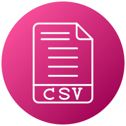

<h1 align="center">
  <a href="https://www.flaticon.com/free-icons/files-and-folders" title="files and folders icons">
    
  </a>
</h1>

<h2 align="center">partitioner-csv-file</h2>
<p> 
  O <strong>partitioner-csv-file</strong> é um script com Node.js para particionar um arquivo com extensão .csv em vários outros com quantidade menor de linhas por arquivo, conforme informado através do arquivo de configuração.
</p>

## :dart: Índice
- [Status](#status)
- [Tecnologias](#tecnologias)
- [Pré-Requisitos](#pre-requisitos)
- [Executando o projeto](#executando-o-projeto)
- [Licença](#licença)

## :game_die: Status
<p align="center">
  
  
  
  
</p>

## :toolbox: Tecnologias
- [node.js](https://nodejs.org/)
- [neat-csv](https://www.npmjs.com/package/neat-csv)
- [objects-to-csv](https://www.npmjs.com/package/objects-to-csv)

## :heavy_check_mark: Pré-requisitos
Antes de iniciar, certifique-se que tenha instalado em seu computador as seguintes ferramentas:
- [Node.js](https://nodejs.org/)
- [Visual Studio Code](https://visualstudio.microsoft.com/pt-br/)

## :gear: Executando o projeto

1. *Faça o clone do repositório:*

```sh
$ git clone https://github.com/LuizEduardoBilotta/partitioner-csv-file
```

2. *Instale as depêndencias do projeto:*

```sh
# Acesse o diretório do projeto:
$ cd partitioner-csv-file

# Instale as dependências:
$ npm install
```

3. *Insira o arquivo a ser particionado no diretório `app/dataset`*

4. *Acesse o arquivo de configuração localizado em `config/config.js` e ajuste os seguintes atributos:*
 - `file` -> _Nome do arquivo a ser particionado (somente o nome sem a extensão)_
 - `recordsPerFile` -> _Quantidade de registros por arquivo_

5. *Execute a aplicação:*
```sh
$ npm start
```

6. *Os arquivos serão gerados no mesmo diretório do arquivo original `app/dataset` com a seguinte estrutura:*
  - `{nome-do-arquivo}-{parte}.{extensão}` 

## :bookmark_tabs: Licença
Este projeto está licenciado nos termos da licença MIT. Veja o arquivo [LICENSE](./LICENSE) para mais detalhes.

## :jigsaw: Contato
- :mailbox_with_mail: E-mail: <a href="mailto:luizeduardobilotta@gmail.com">luizeduardobilotta@gmail.com</a>
- :pushpin: Linkedin: [in/luizeduardobilotta](https://www.linkedin.com/in/luizeduardobilotta)

<sup>Desenvolvido por <i><strong>Luiz Eduardo Bilotta.</i></strong></sup>

